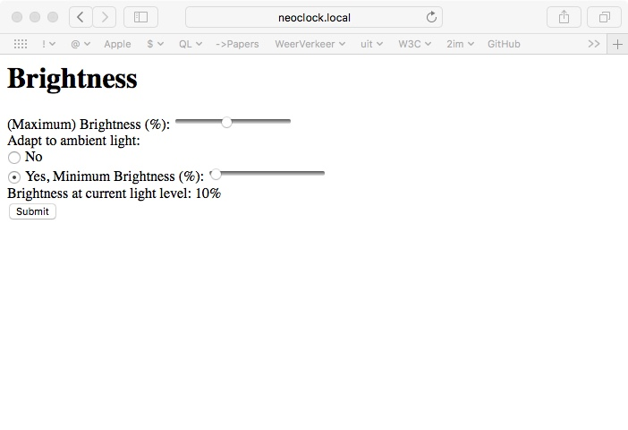

# NeoClock Manual

## Unpacking and connecting

Insert the power supply (5 volt, tip positive) into the little board at the back of the clock and connect to a power outlet.

The clock should show short green hour hand, a long yellow minute hand, a moving white second indicator and a yellow or pink ring.

> 

## Connecting to your WiFi

With the yellow or pink ring the NeoClock tells you that it does not know your WiFi. It will create its own WiFi network, with a name like _config-neoclock_ or _config-iotsa12345_ or something similar.

Connect to that WiFi network with a telephone, laptop or computer.

Open _Safari_ or _Chrome_ or another browser, and in the address bar type

```
http://192.168.4.1
```

This should show you the following window:

> 

Click the _/wificonfig_ link to go to the page where you can tell the NeoClock about your WiFi network:

> 

Fill in the _Network_ and _Password_ fields with your WiFi name and WiFi password. 

Remember the name of your NeoClock, in the _Hostname_ field. (In this example it is _neoclock3_).

If you really want you can also give your clock a different name, but use only letters, digits and hyphen, no spaces or other characters. 

Press _Submit_.

The NeoClock will restart, and after a while should start showing a time (possibly wrong, because it does not know yet which timezone you are in), without the yellow center ring.

Connect your telephone (laptop, PC) back to your normal WiFi network.

## Configuring timezone

When both the NeoClock and your phone (laptop, computer) are connected to your WiFi network you can set it to the correct timezone by opening a browser and typing the following URL in the address bar (with the example _neoclock3_ replaced by the name you remembered above):

```
http://neoclock3.local
```

This will show you the _NeoPixel Clock Server_ page from above again. This time, select the _/ntpconfig_ link to bring you to the time configuration page:

> 

The format of the _Timezone change information_ configuration is rather complicated, but for continental Europe you can simply copy the example text 

```
CEDT,0,1,3,1,120,CET,0,1,10,1,60
```

and press _Submit_. 

Your clock should now show the correct time.

## Clock brightness

You can change the brightness of the clock, and you can make it adapt to available light (so it does not blind you at night but you can still see it during the day).

> Note that adapting the brightness only works if your NeoClock has a little light sensor, probably somewhere near the top. Otherwise you can still set a brightness but it will not change.

Visit the clock homepage, and select the _/brightness_ page:

> 

Use the sliders to select maximum and minimum brightness, and select _Yes_ for adaptation. Press _Submit_.

You can test the brightness by covering the light sensor with something (or shining a light at it).

## More

Your NeoClock can do more things, like showing you alerts or showing things like rain prediction, but for these you need an additional local _Igor_ server. Or you can reprogram it yourself to show the time differently.

Visit <https://github.com/cwi-dis/iotsaNeoClock> and <https://github.com/cwi-dis/igor> if you are interested in this.

## Troubleshooting

If your NeoClock cannot find your WiFi network (for example because you mistyped the password) it will show an orange ring. After a few minutes it will show the yellow or pink ring again, and you can try connecting to the _config-neoclock3_ network again to reprogram it.

It will go into a sequence of trying to connect to the programmed network and its _config_ network every few minutes until everything is right.

There are a few other colors the ring can take:

- _orange_ trying to connect to your Wifi. Will go off (or turn to pink or yellow) after a couple of seconds.
- _red_ factory reset. Should not happen, remove power and hope it goes away.
- _blue_ reprogram. Should not happen, and should fix itself. If the NeoClock does not go back to normal in a few minutes: remove power and hope it goes away.

In case of other problems: contact <Jack.Jansen@cwi.nl> and he will try to help. If there are any lights on: a picture may help. If the are any moving lights on: a movie may help. 
